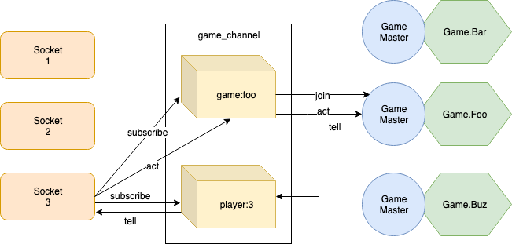

# Gametime

## Background
- Learn some elixir
- Learn about:
  - Sockets
  - LiveView
  - (GenServer)

## Idea
- Coding as a form of gaming
- Players scripts connect to Websockets
- Support multiple games

## Setup
- 

## Learnings Sockets
- Sockets != Channels != Topics !?
- [Game Channel](../lib/gametime_web/channels/game_channel.ex)
- [Socket Player](../lib/gametime/socket_player.ex)
- `handle_in` vs `handle_info`
- Broadcasts go to pubsub sendpoint
- Channels are abstraction on top of pubsub

## Learnings GenServer
- [Game Master](../lib/gametime/game_master.ex)
- Define an API
- Use GenServer under the hood
- `handle_cast` vs `handle_call`

## Learnings LiveView
  - [Game Live](../lib/gametime_web/live/game_live.ex)
  - Can also subscribe to PubSub topics

## Other Learnings
- [`Task`](../lib/gametime/turn.ex) for one off processes
- `receive` and `send`
